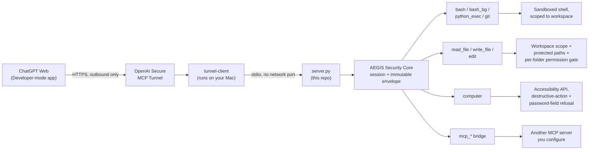
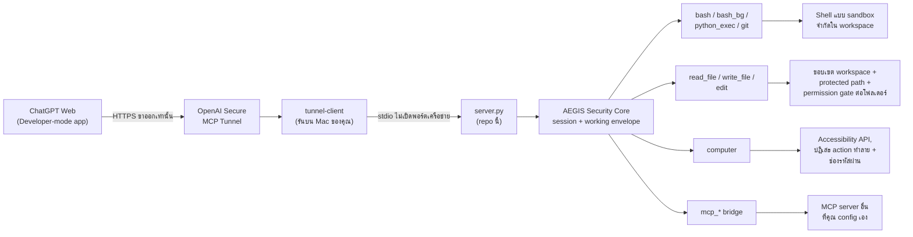

# AEGIS-protected Endeavor Hands

**English** | [ภาษาไทย](#ภาษาไทย)

**A separate quota from Codex.** ChatGPT's own chat usage is billed and
rate-limited independently from OpenAI Codex's coding-agent quota. When
Codex hits its rate limit or your Codex quota runs dry mid-task, you don't
have to stop — point ChatGPT at this MCP server instead. It becomes
ChatGPT's hands and feet on your actual Mac: reading and editing files,
running shell commands and tests, and driving the screen the same way
Codex would, so you keep shipping while Codex's quota resets.

A small, macOS-native MCP server for controlling this Mac from an MCP client.
It deliberately keeps only the local-machine primitives; ChatGPT is the agent
that plans and interprets results.

## Design philosophy: few tools, high capability

Endeavor Hands intentionally keeps the core tool surface small. Instead of
creating a separate MCP tool for every possible intent, it exposes a few
high-capability primitives and lets the model reason about how to combine them.

That choice is deliberate: a very large tool catalog can create overlapping
choices, increase tool-selection ambiguity, and spend model attention deciding
*which tool to call* instead of solving the task. Endeavor Hands aims for a
simpler mental model:

- need to inspect local content → `read_file`
- need to search, execute tests, or inspect the system → `bash`
- need guarded repository operations → `git`
- need to modify an existing file → `edit`
- need to create or replace a complete file → `write_file`
- need numerical/data analysis → `python_exec`
- need visible Mac interaction → `computer`
- need a specialized external capability → connect another MCP server through
  the `mcp_*` bridge

The tools are few, but each one is intentionally deep. For example, `read_file`
handles source code, documents, PDFs, spreadsheets, images, OCR, and media
transcription; `edit` supports exact-string, line-based, and atomic batch edits;
and `computer` combines observation, Accessibility/OCR targeting, interaction,
and post-action verification.

The principle is simple: **keep the tool vocabulary small, make each tool worth
calling, and leave task-level reasoning to the model.** Specialized capabilities
can still be added dynamically through MCP without permanently expanding the
core tool catalog.

## Architecture



Nothing on this Mac ever listens on a network port — the tunnel is an
outbound HTTPS connection this Mac makes out to OpenAI, and the server
itself only speaks stdio to the local `tunnel-client` process. Any other MCP
client (Claude Desktop, `mcp dev`, Codex CLI, ...) can talk to `server.py`
the same way, without the tunnel, if it can spawn the process directly.

## Tools

The server exposes 16 MCP tools. Every tool that can change something on
disk or on screen has a guardrail next to it — see `SECURITY.md` for the
full detail behind each one.

| Tool | What it does | Guardrail |
|---|---|---|
| `aegis_start_session`, `aegis_status`, `aegis_file_state`, `aegis_revoke` | Create/inspect/revoke an immutable Working Envelope and obtain file hashes | Exact high-entropy `session_id + working_envelope_id` pair, immutable canonical root/capabilities, expiry, revocation, protected internal SQLite audit state |
| `bash` | Run a shell command | Runs inside a sandbox profile scoped to the workspace; file-deletion commands are refused |
| `git` | Guarded repository operations (`status`, `diff`, explicit-path `add`, `commit`, non-force `push`) | Repository must be inside the approved workspace; mutation is scoped to Git metadata; hooks/signing and unsafe transports are disabled; stale non-empty `index.lock` recovery requires a parseable Git index; HTTPS credentials are read directly from the trusted macOS Keychain helper without enabling shell-based helpers |
| `bash_bg` | Start/poll/kill a background shell job | Same sandbox as `bash`; registry and logs live under `Endeavor_Hands/work/` |
| `python_exec` | Run Python code with the server's own interpreter | Same sandbox as `bash` |
| `read_file` | Read text, code, PDF/Word/Excel, images, audio/video | Reads anywhere except a fixed list of protected system/credential paths |
| `write_file` | Create a new file, or replace one with `overwrite=true` | `file_write` capability + path inside the immutable root; existing-file replacement also needs current `expected_hash` and the same permission gate as `edit` |
| `edit` | Make a targeted change to an existing file | `file_write` capability + path inside the immutable root + current `expected_hash`; also needs the user's explicit one-time permission per top-level folder for that exact envelope |
| `computer` | See/click/type/scroll/drag, open apps and URLs | Requires macOS Accessibility permission; refuses password/secure-text fields and delete/remove-looking actions |
| `mcp_list_tools`, `mcp_call_tool`, `mcp_add_server`, `mcp_remove_server` | Bridge to another Streamable HTTP or local stdio MCP server you configure | Registration is isolated by exact envelope pair in protected internal state; stdio servers use direct argv, no shell, and the strict envelope sandbox |

Activity is shown live on stderr and persisted to `logs/agent_activity.jsonl`.
MCP protocol messages use stdout exclusively, so do not add normal `print()`
calls to the server or its tools.

## Security at a glance

- **The tunnel is outbound-only** — nothing needs to be exposed to the internet.
- **Every effectful call needs an ACTIVE AEGIS Working Envelope.** The exact
  `session_id + working_envelope_id` pair selects one immutable canonical root,
  capability set, expiry, and revocation state. IDs from different chats cannot
  be mixed. Internal grant/audit/registry state is protected from tool access.
- **Shell/Python writes use a kernel-level allow-list.** In an AEGIS call,
  `sandbox-exec` first denies every filesystem write, then allows only the
  immutable working root and `/private/tmp`. Unlink is denied globally; guarded
  Git receives a narrow exception for its own metadata directory only.
- **Direct file writes are contained and concurrency-checked.** Existing-file
  edits/replacements require the SHA-256 returned by `aegis_file_state`; a stale
  value fails with `CONCURRENT_MODIFICATION_DETECTED`.
- **File deletion is disabled everywhere** — enforced in code, not left to
  the model's judgment.
- **Direct `edit`/overwrite calls need your explicit yes, once per folder,
  per envelope.** This is an extra workflow gate for those two tools. Granting
  `process_exec` already authorizes shell/Python writes anywhere inside the
  envelope root, so choose a narrow root and least capabilities.
- **`computer` won't touch password fields**, refuses delete-looking
  actions, and needs Accessibility permission before it can see or control
  anything.

Full detail is in [SECURITY.md](SECURITY.md) and
[docs/AEGIS_WORKING_ENVELOPES.md](docs/AEGIS_WORKING_ENVELOPES.md).

## Working Envelope workflow

1. The user explicitly authorizes one task root in the conversation.
2. Call `aegis_start_session` with that existing absolute directory, the
   least capabilities needed, and a bounded TTL.
3. Pass the returned exact `sessionId + workingEnvelopeId` pair to every
   effectful tool. Never reuse a pair from another chat.
4. Before `edit` or `write_file(overwrite=true)`, call `aegis_file_state` and
   pass its `sha256` as `expected_hash`.
5. Call `aegis_revoke` when the task is finished; owned background jobs are
   stopped and later calls fail closed.

## Install

Requires macOS on Apple Silicon and Python 3.11.

```bash
git clone https://github.com/halochamp/Endeavor_Hands.git
cd Endeavor_Hands
bash install_library/install.sh
```

The installer creates a project-local `.venv` and installs the hash-locked
dependencies from `requirements.txt` (`mcp`, `langchain-core`, `opencv-python`,
`Pillow`, `markitdown`, `PyMuPDF`, and the `pyobjc` frameworks `computer`
needs). If Xcode Command Line Tools are present, it also builds the optional
Swift helpers used by `computer` (screen accessibility, Apple Vision OCR) and
by `read_file` (speech transcription). Missing Swift tooling only disables
those specific optional features — the core server still runs.

## Run locally

```bash
cd Endeavor_Hands
source .venv/bin/activate
python3 server.py
```

The server communicates through standard input/output. Leave that process
running while the MCP client is connected.

## Configure an MCP client

Use a stdio MCP-server configuration with this command and no arguments —
substitute the absolute path to where you cloned this repo:

```text
command: /absolute/path/to/Endeavor_Hands/.venv/bin/python3
args:
  - /absolute/path/to/Endeavor_Hands/server.py
```

For example, a JSON-style client configuration is:

```json
{
  "mcpServers": {
    "endeavor-hands": {
      "command": "/absolute/path/to/Endeavor_Hands/.venv/bin/python3",
      "args": [
        "/absolute/path/to/Endeavor_Hands/server.py"
      ]
    }
  }
}
```

## macOS permission for `computer`

The first use of `computer` needs macOS Accessibility permission. Open
**System Settings → Privacy & Security → Accessibility** and enable the app
that starts the server—usually Terminal. If the server is started through a
tunnel or launcher, enable that launcher as well (for example `tunnel-client`
or the Python executable when it is listed). Retry after granting access.

Without permission, `computer` returns an explicit actionable error instead of
pretending that the screen has no elements. Screen recording permission may
also be requested by macOS for screenshots; approve it when prompted.

## Connect this server to ChatGPT

ChatGPT web needs a tunnel because it cannot connect to this Mac directly.
This section is the full walkthrough end to end — for the Thai version see
[docs/CHATGPT_SETUP_TH.md](docs/CHATGPT_SETUP_TH.md).

### Part A — set up the tunnel (once)

1. In [OpenAI Platform](https://platform.openai.com/), create a tunnel and
   associate it with the ChatGPT workspace you'll use. Give it a name you'll
   recognize later, e.g. `my-endeavor-mac`. You'll get a Tunnel ID that looks
   like `tunnel_xxxxxxxxxxxxxxxxxxxxxxxxxxxx`.
2. Create a restricted runtime API key with only **Tunnels: Read + Use**. Keep
   it out of files and source control — the setup helper below only ever
   holds it in memory for the current process.
3. Download the Darwin arm64 `tunnel-client` binary from OpenAI Platform and
   place it at `bin/tunnel-client` (gitignored — this repo never ships it).
4. Run the one-time setup helper. It prompts for the Tunnel ID and runtime
   key without saving either credential to disk:

   ```bash
   cd Endeavor_Hands
   ./start_tunnel.sh
   ```

5. It runs `tunnel-client doctor --explain`, then starts the profile with a
   168-hour connection TTL. Keep that Terminal window open — closing it ends
   the tunnel.
6. Check `http://127.0.0.1:8765/readyz` returns `ready` in a browser to
   confirm the client is actually up before moving to Part B.

For every launch after this first one, use
[scripts/start_tunnel.command](scripts/start_tunnel.command) instead (see
"One-click macOS launcher" below) — you only run `start_tunnel.sh` once.

### Part B — connect it inside ChatGPT

1. Open **ChatGPT on the web** (not the desktop/mobile app) in the same
   workspace the tunnel is associated with, and make sure **Developer mode**
   is enabled for that workspace (Settings → look for a Developer mode
   toggle; the exact label can shift as OpenAI rolls out UI changes).
2. Go to **Settings → Apps & Connectors** (sometimes shown as **Plugins**
   depending on rollout) and click **+ Create** to start a new Developer-mode
   app/connector.
3. Under **Connection**, choose **Tunnel** — not a URL. Select the tunnel you
   created in Part A by name (or paste its Tunnel ID if it isn't listed yet).
4. Click **Scan Tools**. ChatGPT connects to the running `tunnel-client` and
   should list all 16 tool names from the [Tools](#tools) table above. If the
   scan comes back empty, re-check that the Terminal from Part A step 4-5 is
   still open and `readyz` still reports `ready`.
5. Save/create the app.
6. Start a **new chat**, open the tools/apps picker, and select the app you
   just created (or mention it with `@` followed by its name).
7. Confirm it actually works with a harmless first request, for example:

   ```text
   List the files directly under ~/Desktop and tell me which ones look like projects.
   ```

   You should see the model call `bash` or `read_file`, and get back a real
   answer describing your actual Desktop contents.

Whenever you change a tool's code or its schema (anything under `tools/` or
the `@mcp.tool()` docstrings in `server.py`), restart the tunnel (Part A steps
4-5, or the one-click launcher) and start a **new chat** — an existing chat
keeps the tool list it discovered when it first connected, and won't pick up
schema changes until you either start a new chat or hit **Refresh/Scan
Tools** again in the app's settings.

## Connect through the OpenAI Responses API

If full write-capable MCP apps are not available in the current ChatGPT plan,
the Responses API can call this server through the same Secure MCP Tunnel.
This route is billed separately from a ChatGPT subscription.

After Part A above is running, launch the included terminal client:

```bash
./scripts/start_api_chat.command
```

The launcher stores the Responses API key and Tunnel ID in separate macOS
Keychain entries and exports them only to the local client process. The client
uses `tunnel_id` directly in the Responses API MCP tool definition and requires
an explicit terminal approval for every MCP call. It defaults to `gpt-5.6`;
set `OPENAI_MODEL` for a different compatible model.

The client uses stored Responses and `previous_response_id` for conversation
continuity. Prompts, MCP arguments, and tool results needed by the model are
therefore sent to and processed by OpenAI. Do not expose files or data that you
do not intend to send to the API.

See [docs/OPENAI_API_TUNNEL_TH.md](docs/OPENAI_API_TUNNEL_TH.md) for the complete
Thai setup and AEGIS smoke-test walkthrough.

## One-click macOS launcher

After the one-time setup above, use
[scripts/start_tunnel.command](scripts/start_tunnel.command) for later
launches — double-click it directly, or copy it to your Desktop first for
convenience. On first launch it asks for the runtime key without echoing it,
then stores the key in the logged-in user's macOS Keychain under
`endeavor-chatgpt-tunnel-runtime`. Later launches retrieve that value only
into the running process environment; neither the launcher nor the tunnel
profile contains the key.

Each launch also writes an owner-only structured JSON lifecycle log under
`logs/tunnel-client/`, with a new timestamped file per run. This preserves the
last shutdown event for troubleshooting without enabling raw HTTP logging.

## Before sharing

Run the privacy check from this directory:

```bash
grep -rIl "api_key\|API_KEY\|secret\|token\|password" --include="*.py" .
find . -iname "*.env*" -o -iname "*token*" -o -iname "*credential*"
```

Review every result before publishing: some matches may be source-code safety
messages or documentation, but credentials must never be committed.

## License

MIT — see [LICENSE](LICENSE).

---

# ภาษาไทย

[English](#aegis-protected-endeavor-hands)

**โควต้าแยกจาก Codex.** การแชทกับ ChatGPT นับโควต้า/rate limit แยกต่างหากจาก
OpenAI Codex (coding agent) โดยสิ้นเชิง เมื่อ Codex ติด rate limit หรือ
โควต้าหมดกลางงาน ไม่ต้องหยุดทำงาน — ให้ ChatGPT ต่อเข้ากับ MCP server ตัวนี้
แทน มันจะกลายเป็น "แขนขา" ของ ChatGPT บนเครื่อง Mac จริงของคุณ: อ่าน/แก้ไฟล์
รันคำสั่ง shell และ test ควบคุมหน้าจอได้เหมือนที่ Codex ทำ ทำให้คุณทำงานต่อ
ได้เรื่อยๆ ระหว่างรอโควต้า Codex รีเซ็ต

MCP server ขนาดเล็กที่รันบน macOS โดยตรง สำหรับให้ MCP client ควบคุมเครื่อง
Mac เครื่องนี้ได้ ตัว server ตั้งใจให้มีแค่ primitive ระดับเครื่อง (bash,
ไฟล์, หน้าจอ) เท่านั้น — ChatGPT เป็นตัววางแผนและตีความผลลัพธ์เอง

## แนวคิดการออกแบบ: Tool น้อย แต่แต่ละ Tool ทำได้ลึก

Endeavor Hands ตั้งใจให้ core tool มีจำนวนน้อย แทนที่จะสร้าง MCP tool แยกตาม
ทุก intent ที่เป็นไปได้ ตัวระบบจะให้ primitive ที่มีความสามารถสูงเพียงไม่กี่ตัว
แล้วปล่อยให้โมเดลใช้ reasoning เพื่อเลือกวิธีประกอบเครื่องมือเหล่านั้นเอง

เหตุผลคือ tool catalog ที่ใหญ่มากอาจมีหน้าที่ทับซ้อนกัน ทำให้ agent ต้องเสีย
ความสนใจไปกับการตัดสินใจว่า *ควรเรียก tool ไหน* แทนที่จะใช้ reasoning กับงาน
ที่ต้องแก้จริง Endeavor Hands จึงพยายามรักษา mental model ให้เรียบง่าย:

- ต้องอ่านหรือทำความเข้าใจเนื้อหาในเครื่อง → `read_file`
- ต้องค้นหา, รัน test หรือคำสั่งระบบ → `bash`
- ต้องทำงานกับ repository แบบมี guardrail → `git`
- ต้องแก้ไฟล์เดิมเฉพาะจุด → `edit`
- ต้องสร้างหรือแทนที่ไฟล์ทั้งไฟล์ → `write_file`
- ต้องวิเคราะห์ข้อมูลหรือตัวเลข → `python_exec`
- ต้องโต้ตอบกับหน้าจอ Mac → `computer`
- ต้องใช้ความสามารถเฉพาะทางภายนอก → ต่อ MCP server เพิ่มผ่าน `mcp_*` bridge

Tool มีน้อย แต่แต่ละตัวตั้งใจให้ทำงานได้ลึก เช่น `read_file` อ่านได้ทั้ง source
code, เอกสาร, PDF, spreadsheet, รูปภาพ, OCR และถอดเสียง/วิดีโอ; `edit` รองรับ
exact-string, line-based และ atomic batch edit; ส่วน `computer` รวมการมองหน้าจอ,
Accessibility/OCR targeting, การควบคุม และการตรวจผลหลัง action ไว้ใน tool เดียว

หลักการคือ **ทำ vocabulary ของ tool ให้เล็ก แต่ทำให้แต่ละ tool คุ้มค่าที่จะเรียก
และปล่อย task-level reasoning ไว้กับตัวโมเดล** หากต้องการ capability เฉพาะทาง
ก็สามารถต่อ MCP เพิ่มแบบ dynamic ได้ โดยไม่ต้องทำให้ core tool catalog โตตามไปด้วย

## โครงสร้างระบบ



ไม่มีอะไรในเครื่อง Mac นี้เปิด listen พอร์ตเครือข่ายเลย — tunnel เป็นการ
เชื่อมต่อ HTTPS ขาออกจาก Mac ไปยัง OpenAI เท่านั้น และตัว server เองคุยกับ
`tunnel-client` ผ่าน stdio ล้วนๆ MCP client ตัวอื่น (Claude Desktop, `mcp dev`,
Codex CLI, ...) ก็คุยกับ `server.py` แบบเดียวกันได้โดยไม่ต้องผ่าน tunnel
ถ้ามันสามารถ spawn process นี้ได้โดยตรง

## รายการ Tools

Server เปิด MCP tool 16 ตัว ทุกตัวที่แก้ไขไฟล์หรือหน้าจอได้จะมี guardrail
กำกับไว้ — ดูรายละเอียดเต็มของแต่ละอันได้ที่ `SECURITY.md`

| Tool | ทำอะไร | Guardrail |
|---|---|---|
| `aegis_start_session`, `aegis_status`, `aegis_file_state`, `aegis_revoke` | สร้าง/ตรวจ/เพิกถอน Working Envelope และอ่าน hash ของไฟล์ | ใช้คู่ `session_id + working_envelope_id` ที่สุ่มแบบ entropy สูง, root/capability แก้ไม่ได้, มีวันหมดอายุ/เพิกถอน และ audit ใน SQLite ภายในที่ tool แตะไม่ได้ |
| `bash` | รันคำสั่ง shell | รันใน sandbox profile จำกัดใน workspace; คำสั่งลบไฟล์ถูกปฏิเสธ |
| `git` | ทำงานกับ repository แบบ guarded (`status`, `diff`, `add` ระบุ path, `commit`, `push` แบบไม่ force) | repo ต้องอยู่ใน workspace ที่อนุมัติ; สิทธิ์ mutation จำกัดที่ Git metadata; ปิด hook/signing และ transport ที่ไม่ปลอดภัย; การกู้ `index.lock` แบบ non-empty ต้องเป็น Git index ที่ parse ได้; HTTPS อ่าน credential โดยตรงจาก trusted macOS Keychain helper โดยไม่เปิด shell-based helper |
| `bash_bg` | เริ่ม/ตรวจสอบ/ปิด background job | sandbox เดียวกับ `bash`; registry และ log อยู่ใต้ `Endeavor_Hands/work/` |
| `python_exec` | รัน Python ด้วย interpreter ของ server เอง | sandbox เดียวกับ `bash` |
| `read_file` | อ่านข้อความ, โค้ด, PDF/Word/Excel, รูปภาพ, เสียง/วิดีโอ | อ่านได้ทุกที่ ยกเว้น path ระบบ/credential ที่กำหนดไว้ตายตัว |
| `write_file` | สร้างไฟล์ใหม่ หรือแทนที่ทั้งไฟล์ด้วย `overwrite=true` | ต้องมี `file_write`, path อยู่ใน root และถ้าแทนที่ไฟล์เดิมต้องมี `expected_hash` ปัจจุบันพร้อม permission gate |
| `edit` | แก้ไฟล์เดิมเฉพาะจุด | ต้องมี `file_write`, path อยู่ใน root, ใช้ `expected_hash` ปัจจุบัน และได้รับอนุญาตครั้งเดียวต่อโฟลเดอร์สำหรับ envelope คู่นั้น |
| `computer` | ดู/คลิก/พิมพ์/scroll/ลาก, เปิดแอปและ URL | ต้องมีสิทธิ์ macOS Accessibility; ปฏิเสธช่องรหัสผ่านและ action ที่ดูเหมือนลบ/ทำลาย |
| `mcp_list_tools`, `mcp_call_tool`, `mcp_add_server`, `mcp_remove_server` | เชื่อมต่อไปยัง MCP server อื่นผ่าน Streamable HTTP หรือ local stdio | registration แยกตามคู่ envelope ใน internal state ที่ tool อ่านไม่ได้; stdio ใช้ argv โดยตรง ไม่ผ่าน shell และอยู่ใน strict sandbox |

กิจกรรมแสดงสดทาง stderr และบันทึกถาวรที่ `logs/agent_activity.jsonl` —
ข้อความ MCP protocol ใช้ stdout เท่านั้น ห้ามเพิ่ม `print()` ธรรมดาในตัว
server หรือ tools

## ภาพรวมความปลอดภัย

- **Tunnel เป็นขาออกเท่านั้น** — ไม่ต้องเปิดอะไรให้อินเทอร์เน็ตเข้าถึงเลย
- **ทุก action ที่มีผลต่อเครื่องต้องมี AEGIS Working Envelope ที่ ACTIVE**
  คู่ `session_id + working_envelope_id` ต้องตรงกัน และผูกกับ canonical root,
  capability, วันหมดอายุ และสถานะเพิกถอนที่แก้ย้อนหลังไม่ได้ ห้ามนำ ID ข้ามแชตมาปนกัน
- **Shell/Python ใช้ write allow-list ระดับ `sandbox-exec`** โดย deny การเขียน
  ทั้งหมดก่อน แล้ว allow เฉพาะ root ของ envelope กับ `/private/tmp` เท่านั้น
  การ unlink ถูก deny ทั้งหมด ยกเว้น Git metadata แบบระบุจุด
- **การแก้/แทนที่ไฟล์เดิมตรวจ concurrent modification** ต้องเรียก
  `aegis_file_state` แล้วส่ง SHA-256 กลับมาเป็น `expected_hash`; ถ้าไฟล์เปลี่ยน
  ระหว่างนั้นจะหยุดด้วย `CONCURRENT_MODIFICATION_DETECTED`
- **การลบไฟล์ถูกปิดไว้ทุกที่** — บังคับในโค้ด ไม่ปล่อยให้โมเดลตัดสินใจเอง
- **การเรียก `edit`/overwrite โดยตรงต้องได้รับ "ใช่" จากคุณก่อน ครั้งเดียวต่อ
  โฟลเดอร์ ต่อ envelope** นี่เป็น workflow gate เพิ่มเติมเฉพาะสอง tool นี้;
  ถ้าให้ `process_exec` แล้ว Shell/Python เขียนได้ทุกจุดภายใน root จึงควรเลือก
  root ให้แคบและให้ capability เท่าที่จำเป็น
- **`computer` ไม่แตะช่องรหัสผ่าน** ปฏิเสธ action ที่ดูเหมือนลบ/ทำลาย และ
  ต้องมีสิทธิ์ Accessibility ก่อนจะเห็นหรือควบคุมอะไรได้เลย

รายละเอียดเต็มอยู่ที่ [SECURITY.md](SECURITY.md) และ
[docs/AEGIS_WORKING_ENVELOPES.md](docs/AEGIS_WORKING_ENVELOPES.md)

## ขั้นตอนใช้ Working Envelope

1. ผู้ใช้อนุญาตงานและ root ที่แน่นอนในบทสนทนาก่อน
2. เรียก `aegis_start_session` ด้วย absolute path, capability เท่าที่จำเป็น และ TTL จำกัด
3. ส่งคู่ `sessionId + workingEnvelopeId` เดิมให้ทุก effectful tool ในแชตนั้น
4. ก่อน `edit` หรือ `write_file(overwrite=true)` ให้เรียก `aegis_file_state`
   แล้วส่ง `sha256` เป็น `expected_hash`
5. เมื่องานเสร็จเรียก `aegis_revoke`; background job ของคู่นั้นจะถูกหยุด

## ติดตั้ง

ต้องการ macOS บน Apple Silicon และ Python 3.11

```bash
git clone https://github.com/halochamp/Endeavor_Hands.git
cd Endeavor_Hands
bash install_library/install.sh
```

ตัวติดตั้งจะสร้าง `.venv` เฉพาะโปรเจกต์ แล้วติดตั้ง dependency ที่ lock
hash ไว้จาก `requirements.txt` (`mcp`, `langchain-core`, `opencv-python`,
`Pillow`, `markitdown`, `PyMuPDF`, และ `pyobjc` framework ที่ `computer`
ต้องใช้) หากมี Xcode Command Line Tools จะ build Swift helper เสริมให้ด้วย
(ใช้กับ `computer` สำหรับ screen accessibility และ Apple Vision OCR, และ
`read_file` สำหรับถอดเสียงพูด) ถ้าไม่มี Swift toolchain จะปิดเฉพาะ
ฟีเจอร์เสริมเหล่านั้น — ตัว server หลักยังทำงานได้ปกติ

## รันในเครื่อง

```bash
cd Endeavor_Hands
source .venv/bin/activate
python3 server.py
```

Server สื่อสารผ่าน standard input/output ให้ปล่อย process นี้รันค้างไว้
ตลอดเวลาที่ MCP client เชื่อมต่ออยู่

## ตั้งค่า MCP client

ใช้ config แบบ stdio MCP-server ด้วยคำสั่งนี้ ไม่ต้องมี argument เพิ่ม —
แทนที่ path ด้วย path จริงที่คุณ clone repo นี้ไว้:

```text
command: /absolute/path/to/Endeavor_Hands/.venv/bin/python3
args:
  - /absolute/path/to/Endeavor_Hands/server.py
```

ตัวอย่าง config แบบ JSON:

```json
{
  "mcpServers": {
    "endeavor-hands": {
      "command": "/absolute/path/to/Endeavor_Hands/.venv/bin/python3",
      "args": [
        "/absolute/path/to/Endeavor_Hands/server.py"
      ]
    }
  }
}
```

## สิทธิ์ macOS สำหรับ `computer`

การใช้ `computer` ครั้งแรกต้องขอสิทธิ์ macOS Accessibility เปิด
**System Settings → Privacy & Security → Accessibility** แล้วเปิดใช้งาน
แอปที่รัน server ไว้ — ปกติคือ Terminal ถ้า server ถูกรันผ่าน tunnel หรือ
launcher ให้เปิดสิทธิ์ให้ตัวนั้นด้วย (เช่น `tunnel-client` หรือ Python
executable ที่ปรากฏในรายการ) แล้วลองใหม่

หากไม่มีสิทธิ์ `computer` จะคืน error ที่บอกวิธีแก้ตรงๆ แทนที่จะแกล้งทำ
เป็นว่าหน้าจอไม่มี element ใดๆ macOS อาจขอสิทธิ์ Screen Recording สำหรับ
การจับภาพหน้าจอด้วย ให้อนุญาตเมื่อถูกถาม

## เชื่อม server นี้เข้ากับ ChatGPT

ChatGPT web ต้องใช้ tunnel เพราะเชื่อมต่อเข้าเครื่อง Mac นี้โดยตรงไม่ได้
หัวข้อนี้คือคู่มือฉบับเต็มตั้งแต่ต้นจนจบ ดูฉบับภาษาไทยแบบละเอียดกว่านี้ได้ที่
[docs/CHATGPT_SETUP_TH.md](docs/CHATGPT_SETUP_TH.md)

### ส่วน A — ตั้งค่า tunnel (ทำครั้งเดียว)

1. สร้าง tunnel ใน [OpenAI Platform](https://platform.openai.com/) แล้ว
   associate เข้ากับ ChatGPT workspace ที่จะใช้ ตั้งชื่อที่จำง่าย เช่น
   `my-endeavor-mac` คุณจะได้ Tunnel ID รูปแบบ
   `tunnel_xxxxxxxxxxxxxxxxxxxxxxxxxxxx`
2. สร้าง runtime API key แบบจำกัดสิทธิ์เฉพาะ **Tunnels: Read + Use** เก็บ
   key นี้ให้ห่างจากไฟล์และ source control — ตัวช่วยตั้งค่าด้านล่างเก็บ key
   ไว้ในหน่วยความจำของ process ปัจจุบันเท่านั้น
3. ดาวน์โหลด `tunnel-client` (Darwin arm64) จาก OpenAI Platform แล้ววางไว้ที่
   `bin/tunnel-client` (ถูก gitignore ไว้ — repo นี้ไม่แนบไฟล์นี้มาให้)
4. รันตัวช่วยตั้งค่าครั้งแรก — จะถาม Tunnel ID และ runtime key โดยไม่บันทึก
   ทั้งคู่ลงดิสก์เลย:

   ```bash
   cd Endeavor_Hands
   ./start_tunnel.sh
   ```

5. มันจะรัน `tunnel-client doctor --explain` แล้วเริ่ม profile ด้วย
   connection TTL 168 ชั่วโมง เปิด Terminal นี้ค้างไว้ — ถ้าปิดหน้าต่างนี้
   tunnel จะหยุดทำงาน
6. เปิดเบราว์เซอร์ไปที่ `http://127.0.0.1:8765/readyz` ต้องขึ้น `ready` ก่อน
   ค่อยไปทำส่วน B ต่อ

การเปิดครั้งถัดๆ ไปทั้งหมด ให้ใช้
[scripts/start_tunnel.command](scripts/start_tunnel.command) แทน (ดูหัวข้อ
"One-click launcher บน macOS" ด้านล่าง) — `start_tunnel.sh` รันแค่ครั้งเดียว
พอ

### ส่วน B — เชื่อมเข้ากับ ChatGPT

1. เปิด **ChatGPT บนเว็บ** (ไม่ใช่แอป desktop/มือถือ) ใน workspace เดียวกับที่
   associate tunnel ไว้ และตรวจว่า **Developer mode** เปิดใช้งานอยู่สำหรับ
   workspace นั้น (อยู่ใน Settings — ชื่อ toggle อาจเปลี่ยนไปตามการ rollout
   ของ OpenAI)
2. เข้า **Settings → Apps & Connectors** (บางครั้งแสดงเป็น **Plugins** ตาม
   การ rollout) แล้วกด **+ Create** เพื่อสร้าง Developer-mode app/connector ใหม่
3. ในหัวข้อ **Connection** เลือก **Tunnel** — ไม่ใช่ URL แล้วเลือก tunnel ที่
   สร้างไว้ในส่วน A ตามชื่อ (หรือใส่ Tunnel ID เองถ้ายังไม่ขึ้นในรายการ)
4. กด **Scan Tools** ChatGPT จะเชื่อมต่อไปยัง `tunnel-client` ที่รันอยู่ และ
   ควรเจอ tool ครบทั้ง 16 ตัวตามตาราง [รายการ Tools](#รายการ-tools) ด้านบน ถ้า scan แล้ว
   ไม่เจออะไรเลย ให้ตรวจว่า Terminal จากส่วน A ขั้นตอน 4-5 ยังเปิดอยู่ และ
   `readyz` ยังตอบ `ready`
5. บันทึก/สร้าง app
6. เปิดแชตใหม่ เปิดเมนู tools/apps แล้วเลือก app ที่เพิ่งสร้าง (หรือพิมพ์
   `@` ตามด้วยชื่อ app)
7. ทดสอบด้วยคำสั่งที่ไม่มีความเสี่ยงก่อน เช่น:

   ```text
   ดูรายชื่อไฟล์ที่อยู่ตรงใต้ ~/Desktop แล้วบอกว่าอันไหนดูเหมือนเป็นโปรเจกต์
   ```

   ควรเห็นโมเดลเรียก `bash` หรือ `read_file` แล้วได้คำตอบจริงตามเนื้อหา
   Desktop ของคุณ

เมื่อไหร่ก็ตามที่แก้โค้ดของ tool หรือ schema ของมัน (ไฟล์ใต้ `tools/` หรือ
docstring ใน `@mcp.tool()` ที่ `server.py`) ให้ restart tunnel (ส่วน A
ขั้นตอน 4-5 หรือ one-click launcher) แล้วเปิดแชต**ใหม่** — แชตเดิมจะยังใช้
รายการ tool ที่ค้นพบตอนเชื่อมต่อครั้งแรกอยู่ ไม่รับรู้การเปลี่ยน schema
จนกว่าจะเปิดแชตใหม่ หรือกด **Refresh/Scan Tools** ใน settings ของ app อีกครั้ง

## One-click launcher บน macOS

หลังตั้งค่าครั้งแรกด้านบนแล้ว ใช้
[scripts/start_tunnel.command](scripts/start_tunnel.command) สำหรับการเปิด
ครั้งถัดไป — ดับเบิลคลิกได้เลย หรือคัดลอกไปวางบน Desktop ก่อนก็ได้เพื่อ
ความสะดวก การเปิดครั้งแรกจะถาม runtime key โดยไม่แสดงตัวอักษร แล้วเก็บ key
ไว้ใน macOS Keychain ของผู้ใช้ที่ login อยู่ ภายใต้ชื่อ
`endeavor-chatgpt-tunnel-runtime` การเปิดครั้งถัดไปจะดึงค่านั้นเข้ามาแค่ใน
process environment ที่กำลังรันเท่านั้น — ทั้ง launcher และ tunnel profile
ไม่มี key อยู่ในไฟล์เลย

ทุกการเปิดจะบันทึก structured JSON lifecycle log ที่จำกัดสิทธิ์เฉพาะเจ้าของ
ไว้ใต้ `logs/tunnel-client/` โดยแยกไฟล์ตามเวลาแต่ละรอบ เพื่อเก็บเหตุการณ์
สุดท้ายก่อน shutdown สำหรับการวิเคราะห์ โดยไม่เปิด raw HTTP logging

## ก่อนแชร์ออกไป

รันการตรวจสอบความเป็นส่วนตัวจากโฟลเดอร์นี้:

```bash
grep -rIl "api_key\|API_KEY\|secret\|token\|password" --include="*.py" .
find . -iname "*.env*" -o -iname "*token*" -o -iname "*credential*"
```

ตรวจทานผลลัพธ์ทุกรายการก่อนเผยแพร่ บางรายการอาจเป็นแค่ข้อความความปลอดภัย
ในโค้ดหรือเอกสาร แต่ credential จริงต้องไม่ถูก commit เด็ดขาด

## สัญญาอนุญาต

MIT — ดู [LICENSE](LICENSE)
