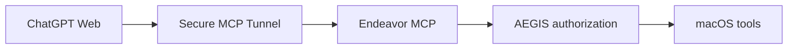

# AEGIS Working Envelopes

AEGIS is the authorization boundary in front of Endeavor Hands. ChatGPT remains
the planner and Endeavor remains the Mac tool layer, but no effectful tool may
run until the exact task authority has been selected.



## Trust model

Production authorization starts from **ChatGPT-trusted user intent**: ChatGPT
must call `aegis_start_session` only after the user has explicitly authorized
the task and exact root in the conversation. The call creates an ACTIVE grant
immediately and returns the non-secret selector marker `sessionToken: "context"`.

AEGIS then enforces mechanics that do not depend on model judgment:

- exact high-entropy `session_id + working_envelope_id` selection;
- immutable canonical root and capability set;
- ACTIVE state, expiry, and revocation;
- canonical path and symlink containment;
- request-local context binding, never a global current workspace;
- process/background-job ownership by the exact pair;
- protected internal SQLite grant/audit state;
- optimistic SHA-256 checks for direct existing-file mutation.

This is a local single-owner boundary. It is not a multi-user OS account
sandbox, and `computer_control` can affect whichever visible app the user has
allowed the agent to control. Existing password/OTP/payment and destructive UI
refusals remain in force.

The envelope is a **mutation boundary**, not a confidentiality/network
boundary. `bash` and `python_exec` retain outbound network access and can read
most non-protected paths outside the root. Granting `process_exec` authorizes
writes anywhere inside the root; its subprocesses do not use the direct-edit
folder nonce. Remote nested MCP effects and visible-app actions are likewise
not contained by the filesystem root. Revocation is prospective: it blocks new
calls and stops owned background jobs, but does not undo completed effects or
guarantee cancellation of an already-running synchronous call.

## Capabilities

| Capability | Tools/effects |
|---|---|
| `file_write` | `write_file`, `edit`, and `aegis_file_state` concurrency tokens |
| `process_exec` | `bash`, `bash_bg`, `python_exec` |
| `git` | guarded status/diff/add/commit/non-force push |
| `computer_control` | screen observation and guarded Mac UI actions |
| `mcp_call` | list/call tools on a configured nested MCP server |
| `mcp_manage` | add/remove envelope-scoped nested MCP registrations |

Use the least set needed for the task. TTL must be 5–10,080 minutes.

## Normal call sequence

```text
1. User explicitly authorizes /absolute/project/root and the requested work.
2. aegis_start_session(root, capabilities_json, ttl_minutes)
3. Pass session_id + working_envelope_id to every effectful tool.
4. For an existing file:
   aegis_file_state(path) -> sha256
   edit(..., expected_hash=sha256) or write_file(..., expected_hash=sha256)
5. aegis_revoke(...) when finished.
```

The direct `edit`/existing-file replacement consent gate remains as an
additional explicit per-top-level-folder round trip. Its nonce is scoped to
the exact envelope pair.

## Process containment

For an AEGIS-bound subprocess, the generated macOS `sandbox-exec` profile:

1. denies all filesystem writes;
2. allows writes only below the immutable envelope root and `/private/tmp`;
3. denies unlink globally;
4. permits unlink only inside selected Git metadata for guarded Git mutation;
5. denies access to credential paths and Endeavor/AEGIS internal state.

Arbitrary shell text is therefore not trusted to describe its own mutation
targets. The OS sandbox enforces the write root even when a command contains a
redirection, script, compiler, package manager, or child process.

## Fail-closed errors

Important codes include:

- `ENVELOPE_NOT_FOUND`
- `ENVELOPE_EXPIRED`
- `ENVELOPE_REVOKED`
- `CAPABILITY_DENIED`
- `PATH_OUTSIDE_ENVELOPE`
- `EXPECTED_HASH_REQUIRED`
- `CONCURRENT_MODIFICATION_DETECTED`

Do not route around a refusal through another tool. Re-authorize a narrower or
different envelope only after the user explicitly approves the changed scope.

---

# ภาษาไทย

AEGIS คือด่านอนุญาตที่อยู่หน้า Endeavor Hands โดย ChatGPT ยังเป็นผู้คิดและ
วางแผน ส่วน Endeavor เป็นเครื่องมือบน Mac แต่ทุก action ที่มีผลต่อเครื่องต้อง
ผ่าน Working Envelope ก่อน

หลักสำคัญคือคู่ `session_id + working_envelope_id` ต้องตรงกันเสมอ และผูกกับ
canonical root, capability, อายุ และสถานะเพิกถอนที่แก้ย้อนหลังไม่ได้ ใช้
`ContextVar` แยกตาม request จึงไม่มี global current workspace ที่แชตหนึ่งจะ
เผลอรับสิทธิ์จากอีกแชต

สำหรับ shell/Python ระบบใช้ `sandbox-exec` แบบ write allow-list: ปิดการเขียน
ทั้งหมดก่อน แล้วเปิดเฉพาะ root ของงานกับ `/private/tmp`; ปิด unlink ทั้งหมด
ยกเว้น Git metadata ที่จำเป็นแบบเจาะจง ส่วนการแก้ไฟล์เดิมต้องตรวจ SHA-256
ปัจจุบันเพื่อกันไฟล์เปลี่ยนระหว่างอ่านกับเขียน

ขอบเขตนี้คุม mutation ไม่ใช่ confidentiality/network: Shell/Python ยังออก
network และอ่าน path ส่วนใหญ่นอก root ได้ (ยกเว้น credential/internal path)
และเมื่อให้ `process_exec` แล้วจะเขียนได้ทุกจุดภายใน root โดยไม่ผ่าน nonce ของ
direct edit ส่วน Computer/remote MCP อาจสร้างผลนอก filesystem root การ revoke
ปิด call ใหม่และหยุด background job แต่ไม่ย้อนผลที่เกิดแล้วหรือรับประกันการ
ยกเลิก synchronous call ที่กำลังรัน

ขั้นตอนใช้งานคือ ผู้ใช้อนุญาต root และงานในบทสนทนา → เรียก
`aegis_start_session` → ส่ง ID คู่เดิมให้ทุก effectful tool → ใช้
`aegis_file_state` ก่อนแก้ไฟล์เดิม → เรียก `aegis_revoke` เมื่อจบงาน
